# Xepeling-Banking-App

> Proyecto que contiene lo realizado para la ejecución de la prueba tecnica de ingreso a Xepelin

## Arquitectura
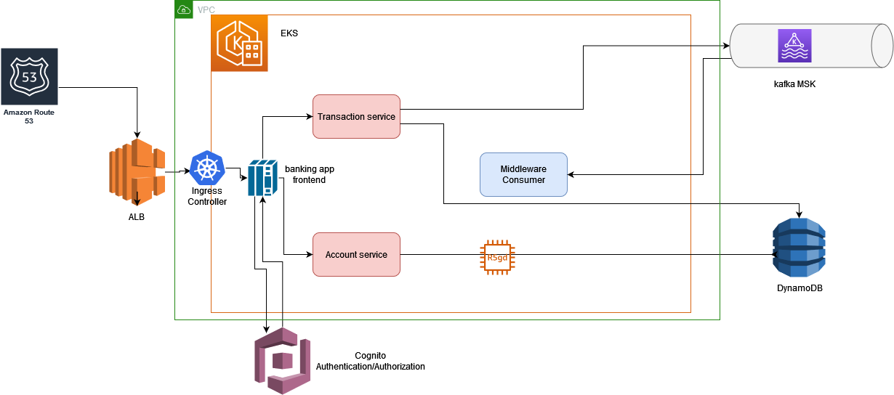

> La arquitectura esta conformada

> 1. **Transaction-service**: Microservicio encargado de las operaciones con las transacciones para deposito y retiro de dinero de las cuentas. 
> 2. **Account-service**: Microservicio encargado de las operaciones a nivel de cuentas
> 3. **Middleware-Consumer**: Oyente o interceptor de transacciones que superan determinado monto    
> 4. **DynamoDB**: Almacen de eventos y registro de persistencia para nuestro sistema      
> 5. **Kafka**: Broken para el manejo de eventos
> 6. Los demas componentes de la arquitecura son parte de la infra y componentes transversales que se deberian implementar en AWS para cumplir con minimos conidicones de operación

## Empezando

## Instalación

El Proyecto puede ser ejecutado completamente a traves de docker compose.

### Prerequisitos
Lo que necesitaras para ejecutar los componentes sera:
1. [Java-11]
2. [Maven]
3. [Nodejs]
4. [Docker]


### Descargar proyecto

via https: https://github.com/deiru87/xepeling-bank

via ssh: git@github.com:deiru87/xepeling-bank.git

Branch: master

### Compilando proyecto Backend y generando imagenes docker

#### Construyendo

Escribe en la consola:
  ```sh
        cd /xepeling-bank/backend/banking-app
   ```

Escribe en la consola:
  ```sh
        mvn -P local clean package install docker:build
   ```
este ultimo comando; compilara, cejecutara pruebas unitarias y construira las imagenes de docker de los tres componentes del backend


### Compilando proyecto FrontEnd

#### Construyendo

Escribe en la consola:
  ```sh
        cd /xepeling-bank/frontend/banking-app-react
   ```

Escribe en la consola:
  ```sh
       npm install
       npm run test
   ```   

Estos comandos instalaran dependencias y ejecutaran pruebas unitarias

para ejecutarlo localmente sin docker-compose ejecuta:
  ```sh
      npm start
   ``` 

#### Ejecutando aplicación con docker-compose

Escribe en la consola
  ```sh
        cd /xepeling-bank/docker-compose
   ```

Debes asegurar los prerequisitos de docker, linux y demas necesarios para la ejecución satisfactoria

Escribe en la consola:
```sh
        docker compose up
```


## Documentación de los servicios

#### Servicio para crear cuenta
Este servicio es el responsable de la creación de cuentas
***Method: POST***

```sh
URL: http://localhost:8080/v1/accounts
Method: POST
Header: Content-type:application/json

curl --request POST \
  --url http://localhost:8080/v1/accounts \
  --header 'Access-Control-Allow-Origin: *' \
  --header 'Content-Type: application/json' \
  --header 'User-Agent: insomnia/8.3.0' \
  --data '{
	"id": 1,
	"name": "",
	"balance": 0,
	"version": 0
	
}'
```

Request Body:
```json
    {
      "id": 1,
      "name": "DEIMER",
      "balance": 0,
      "version": 0
    }
```

Body Parameters:
* **body**: representa los valores de una cuenta que se persistiran inicialmente  **[REQUIRED]**


Salida:

Respuesta Exitosa:

```
            HTTP 200 OK
```

```json
    {
    "accountId": 1,
    "name": "DEIMER",
    "balance": 0,
    "eventDate": null,
    "version": 0
    }
```

Respuesta cuando se pasan mal parametros    

```
            HTTP 400 Bad Request
```
        
        
#### Servicio para obtener balance de cuenta
Este servicio permite obtener el balance de una cuenta a partir de su ID

***Method: Get***

```sh
URL: http://localhost:8087/v1/mutant
Method: GET

curl --request GET \
  --url http://localhost:8080/v1/accounts/1/balance \
  --header 'User-Agent: insomnia/8.3.0'
```

PathParam
```
    http://localhost:8080/v1/accounts/{accountId}/balance
```

Salida:

Respuesta Exitosa

```
            HTTP 200 OK
```

```json
    {
      "accountId": 1,
      "name": "DEIMER",
      "balance": 0,
      "eventDate": "2023-11-08T01:25:22.1002916",
      "version": 0
    }
```

Respuesta cuando se pasan mal parametros

```
            HTTP 400 Bad Request
```
        

#### Servicio para ejecución de transacciones

Este servicio permite generar transacciones para deposito o reirro


***Method: POST***

```sh
URL: http://localhost:8081/v1/transactions
Method: POST
Header: Content-type:application/json

curl --request POST \
  --url http://localhost:8081/v1/transactions \
  --header 'Content-Type: application/json' \
  --header 'User-Agent: insomnia/8.3.0' \
  --data '{
	"accountId": 1,
	"type": "DEPOSIT",
	"amount": 100.0
}'
```

Salida:

Respuesta exitosa

```json
            {
            "id": "341517c5-1efe-4f70-860c-0a233cc797a5",
            "accountId": 1,
            "type": "DEPOSIT",
            "amount": 100.0,
            "eventDate": null
            }
```

Respuesta cuando se pasan mal parametros

```
            HTTP 400 Bad Request
```


## Evidencias de funcionamiento:

A continuación de relacionan las imagenes evidencias del front-end operando en conjunto con el backend para crear una cuenta, hacer transacciones y validar el balance de esta.

Pantalla inicial
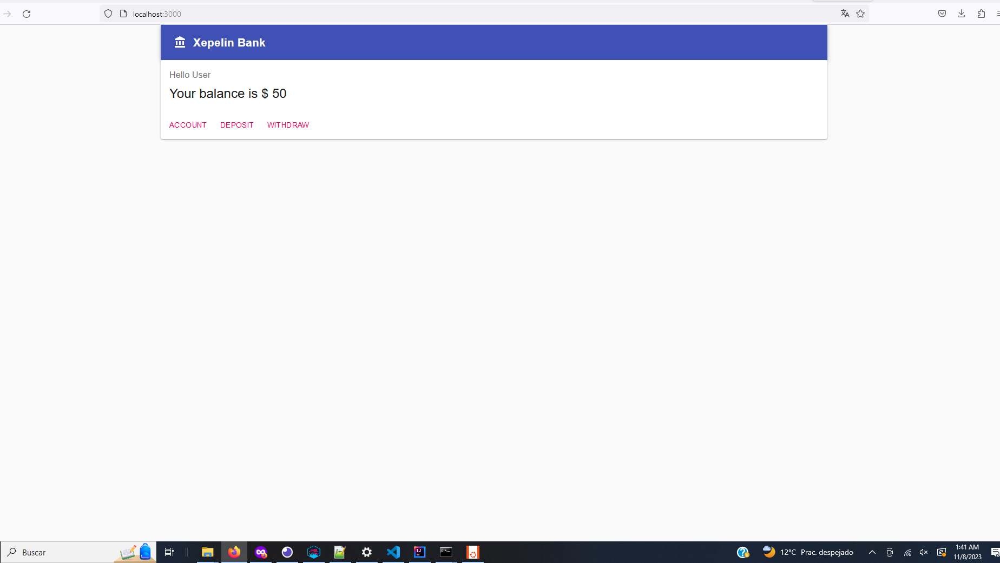
Se evidencia la no existencia de un usuario o tomador de cuenta, por ende una cuenta
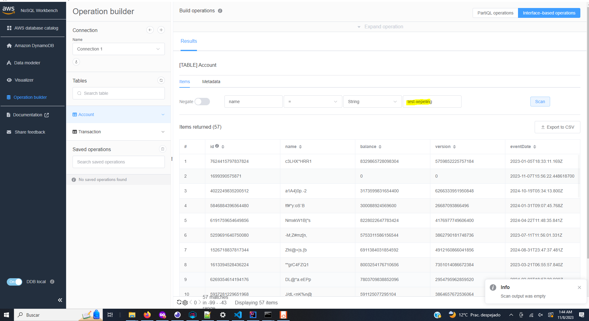
Se crea una cuenta
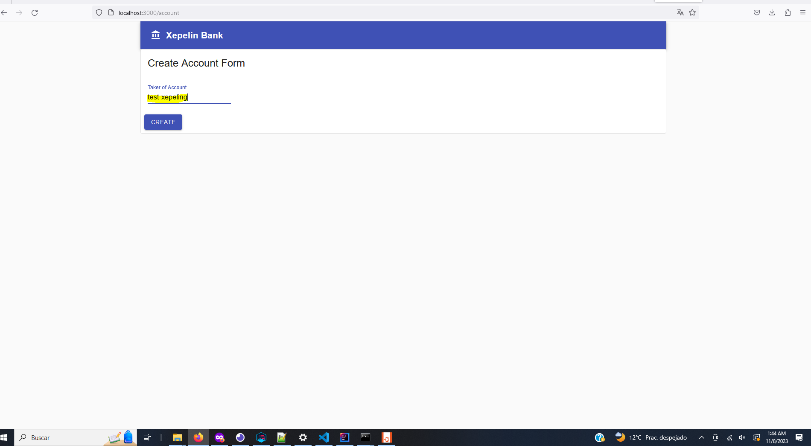
Se refleja la cuenta en dynamo
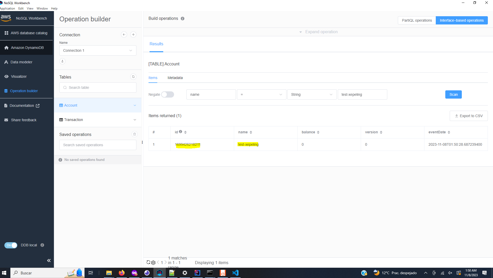
Se observa que el middleware imprime la ocurrecia de evento superior a 10000
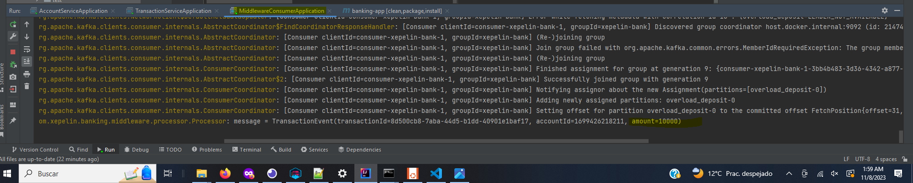
Despues de hacer dos depositos de 10000 validamos balance
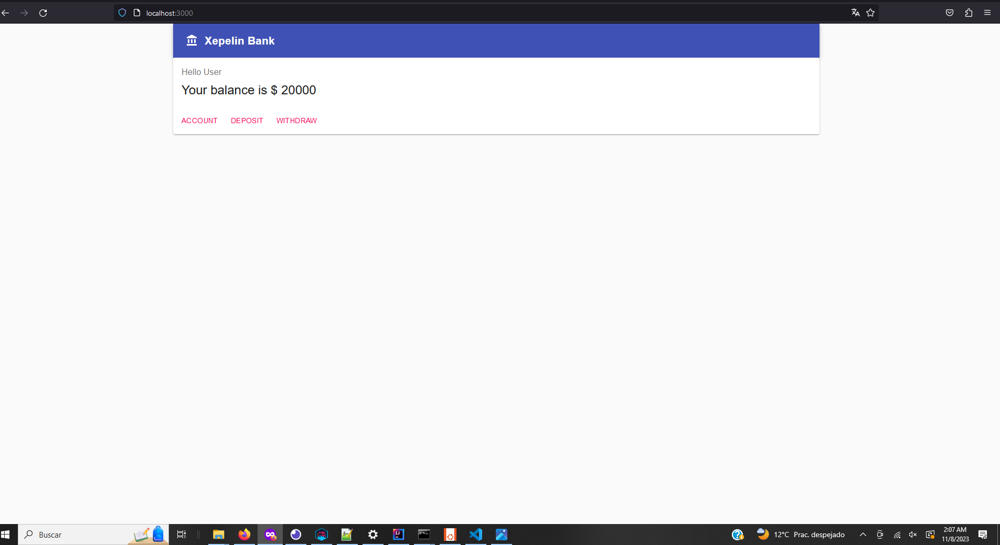
De igual forma en dynamo
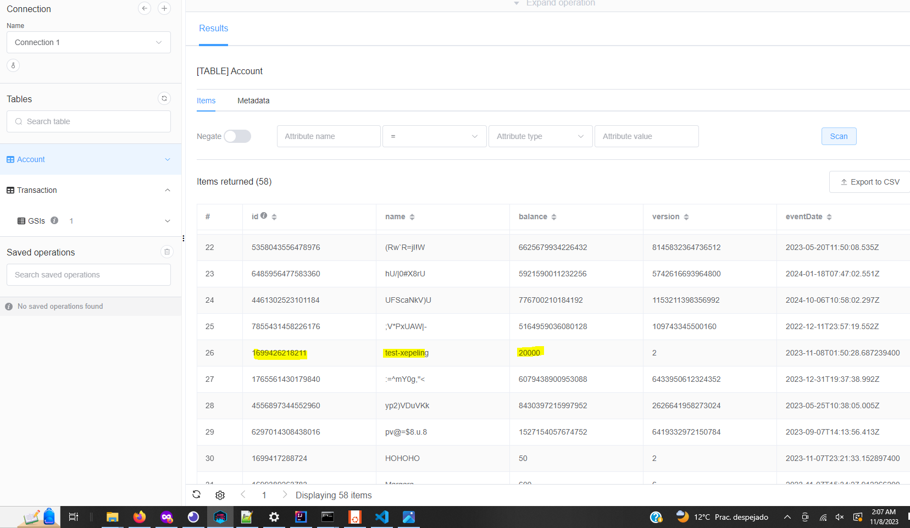
Validamos retiro
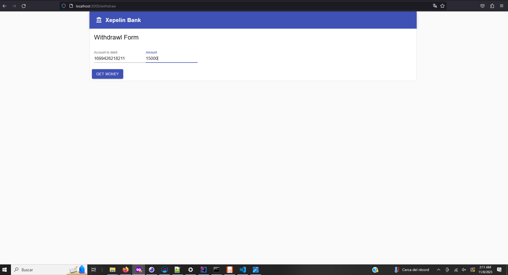
revisamos dynamo
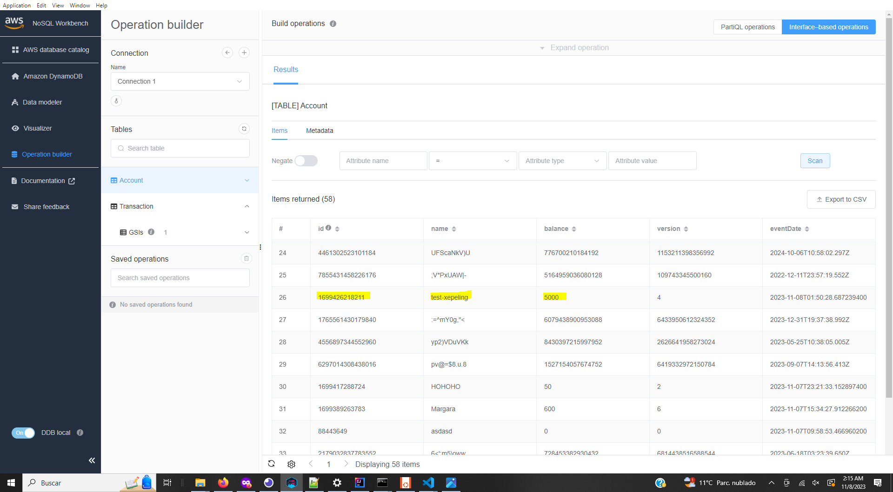
Validaciones generales de error
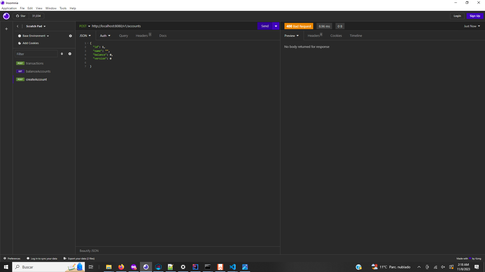